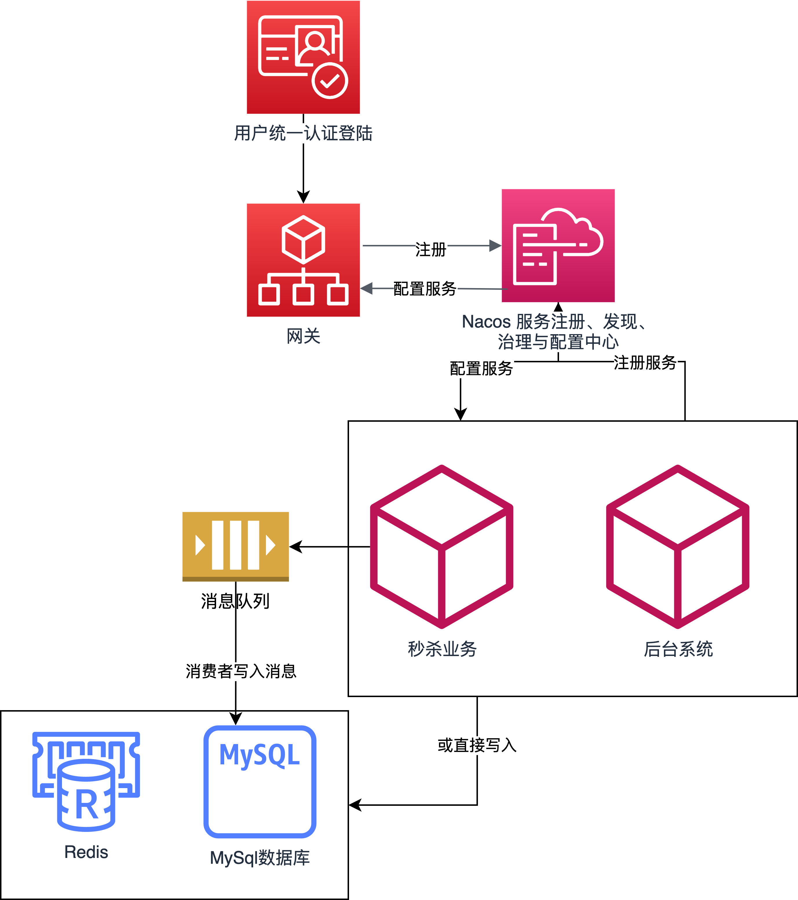
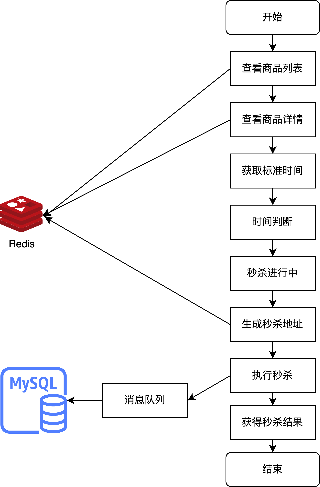

# seckillcloud-pure

## 前言
项目是基于[自己已开源的Java微服务方案的商品秒杀系统](https://github.com/weiraneve/seckillcloud)，将登录、授权、监控等功能去掉。

本项目版本迭代至1.0.0，欢迎各位多多交流。

## 简介
项目采用了SpringBoot框架、SpringCloud微服务架构、SpringCloud Gateway网关技术栈、SpringCloud alibaba技术栈Nacos、SpringCloud Netflix技术栈容灾和均衡负载和Feign进行服务间的通信、
持久层MybatisPlus框架、Flyway数据库版本管理工具和多数据源处理方案、中间件缓存Redis与相关框架、SpringBoot Admin技术栈、中间件消息队列RabbitMQ等一系列技术栈，
优化项目中的消息队列与缓存与分表分库等技术，解决了秒杀系统设计与实现中，并发不安全的难题与数据库存储的瓶颈，并使用针对Redis的LUA脚本解决高并发下的商品超卖问题。微服务构架技术，
则赋予了项目需要的容灾性和可扩展性，从而完成了一个具有高并发、高可用性能的秒杀系统以及灵活配置秒杀业务与策略的秒杀系统。

## 项目模块
因为是用微服务架构构建的项目，很多地方需要一些微服务必须的组件。下面简单介绍一些项目模块。
- cloud-gateway
微服务网关模块，使用的是SpringCloud Gateway，这里的注册中心用的是Nacos。
网关承担的角色有：请求接入，作为所有API接口服务请求的接入点，比如这里所有模块都可以用网关的端口 8205/ 加上配置文件里的路由，可以直接访问下游的模块；中介策略，实现安全、验证、路由、过滤、流控等策略等。
- cloud-common
通用模块。负责一些通用的依赖管理和一些通用代码如Redis等的复用。
- cloud-manage
后台管理系统模块。使用Feign调用mission模块的一些接口，完成商品信息的增删查改的灵活配置和订单。对应cloud-manage表。manage模块的登录，任何账号和密码都可以登录，默认权限为super_admin
- cloud-mission
主要秒杀业务模块。对应cloud-mission-goods、order、seckillGoods三个表的多数据源。涉及到订单查询直接把所有订单信息返回，涉及到秒杀时刻的orderId则是用的当前的时间戳。

## 图文一览

用户统一认证模块是给客户端秒杀模块提供认证功能，后台系统自己拥有独立的认证系统。项目整体的软件架构图如下。



查看商品列表、查看商品详情和生成唯一的秒杀地址都有Redis参与，而订单写入则有消息队列参与。秒杀业务的流程图如下。



## 如何使用
- 项目拥有Flyway数据库版本管理，首先在项目启动之前需要创建对应的Mysql数据库，cloud-mission-goods、 cloud-mission-order、
  cloud-mission-seckillGoods、cloud-manage。可以使用命令行`mysql -u root -p < ./sql/init/init.sql` 初始化创建数据库。
然后分别启动下述中间件，如果没启动好中间件，项目则会报错。
- 启动Nacos，如果没有则先安装，安装后按网上文章博客启动。
- 启动本地的Redis，密码为空即可。如果本地没有安装Redis，则先安装。
- 启动本地的RabbitMQ(没有则安装，网上搜索如何安装RabbitMQ与可视化软件)，用户名和密码默认即可。
- 当对应的中间件都启动好后，启动项目Flyway会自动帮助创建对应的表结构和导入一些必要的初始信息。对应的SQL文件在sql文件夹中，
Flyway的迁移sql文件则在对应模块之中。依次启动项目中的cloud-gateway、cloud-mission、cloud-manage模块， 
如果不用到后台管理系统可以不启动cloud-manage模块。
- cloud-monitor模块的SpringBoot Admin监控技术栈，使用只需要开启网关后访问http://localhost:8205/monitor 或者直接访问monitor端口。
- 启动后台前端服务器和客户端前端服务器。客户端有账号和密码(密码都为123)，因为flutter还没有加上加盐加密传输能力，
所以有明文账号和密码就在sql里(账号：12345678910，密码：123)； 后台系统有超级管理员账号与密码和普通管理员账号与密码(密码都为123)
秒杀项目客户端端口为3000，秒杀项目后台系统端口为3001。
因为项目中使用了qiniu云对象储存配置上传空间，如若需要，需在配置文件中配置自己的域名以及信息（已经加密脱敏）。
- cloud-manage调用cloud-mission模块的商品上传配置是使用qiniu相关的依赖，也需要qiniu云对象储存账号的一些信息，
项目是使用了配置文件加密脱敏后qiniu云对象储存密钥信息。其中配置商品图片(只能上传jpg后缀图片文件)的功能有qiniu云对象储存以及对应依赖提供。
- docker-compose使用的话，先要把所有module的jar包打出来，`mvn install` 然后 在项目文件夹根目录运行`docker-compose up -d`即可。

## 后台配置的OSS
本项目关于`admin-manager`部分的商品图片存储，是使用[七牛云](https://www.qiniu.com/)的对象存储Kodo功能。

想详情由自己配置的，可去七牛云官网注册免费使用。然后修改`mission`模块中的`application.yml`文件中的:
`qiniu`的`accessKey`,`secretKey`,`bucket`,`domain`。自己账户的`accessKey`,`secretKey`可以在七牛云的密钥管理中查看。
`bucket`,`domain`分别是对象存储空间名和域名，对象存储空间可以在七牛云里免费申请和使用。域名则需要用七牛云中配置的自己的域名。

## 中间件启动脚本
以下是中间件启动`shell`脚本，保存为名字为`mid`，然后放到macos的环境变量`PATH`之下，也可以自己去设置环境变量PATH `export PATH="${HOME}/env:$PATH"` 在`~/.zshrc`中。
然后使用命令行`mid start`、`mid stop`、`mid remove`来实现启动、停止、清理日志文件。目前脚本只适配macos && linux环境，
```shell
if [[ $1 == 'start' ]]; then 
    sh ${HOME}/env/nacos/bin/startup.sh -m standalone
    redis-server /opt/homebrew/etc/redis.conf &
    rabbitmq-server -detached
    exit 0
fi 

if [[ $1 == 'stop' ]]; then
    sh ${HOME}/env/nacos/bin/shutdown.sh -m standalone
    redis-cli shutdown
    rabbitmqctl stop
    exit 0
fi

if [[ $1 == 'remove' ]]; then
    rm -r ${HOME}/nacos
    rm -r ${HOME}/logs
    rm -r ${HOME}/nohup.out
    rm -r ${HOME}/derby.log
    exit 0
fi

echo echo "usage: mid <start | stop ｜ remove> [args]"
exit 1
```

## 参考与测试数据
[一些自己收集的知识点和参考](./docs/THINK.md)

## swagger
项目对应模块启动之后，可以通过path查看swagger文档
- mission-module http://localhost:8205/mission/swagger-ui.html
- manage-module http://localhost:8205/manage/swagger-ui.html

## 秒杀的代码逻辑
- 后端相关的秒杀代码，没有选择Redisson分布式锁，因为项目中没有使用过多的Redis事务逻辑和Redis分布式逻辑。秒杀主要运用的是Redis库存预热、LUA脚本、
加载和Redis预减库存解决超卖，RabbitMQ消息队列使用串行化，保证项目的高可用和高并发。
- 秒杀的策略配置，是由cloud-manage模块提供，持久层主要使用MyBatis完成。
- 在后台系统中，在商品列表里增加一个商品，则会分别在商品表和库存表中分别增加对应的信息，以及在Redis缓存中的商品缓存和库存缓存中增加，并且也会在后台秒杀库存页面中显示。
并且在商品信息中有是否启用这个信息以及对应的控制，不启用的时候，客户端访问商品列表只会显示那些缓存中的启用的商品信息。
- 在后台中使用的SpringSecurity的JWT认证，而客户端使用的是自己写的Token加盐令牌的逻辑，每次客户端访问接口就需要前端服务器传递token给后端验证。
其中的客户端的登录和注册的密码，为了做到脱敏，都是前端服务器进行国密加密然后传输到后端存储。
- 后台系统中，简单实现一个对于用户是否能有资格进入秒杀系统的灵活配置，这里逻辑相对简略，此处的完成度不高。
- 后台管理系统的接口应该遵从微服务的规则，一个服务模块使用一个数据库，这里可用Feign来调用，即cloud-manage去调用cloud-mission模块的接口来调用。本项目目前使用MyBatis配置多数据源来调用资源。
- 对于高并发下的超卖问题，项目测试过synchronized锁、Redisson分布式锁，在能保证并发安全的情况下，性能都有不少地损失，所以采取了LUA脚本解决，使Redis的操作具有原子性，做到了避免超卖。
- cloud-mission模块，对于订单防重和写入的逻辑，根据用户id和商品id做一定地计算后得出订单id，结合幂等机制写入库中。
- cloud-mission使用Feign被cloud-manage模块调用接口，并且是MyBatisPlus与MyBatis共存使用。
- 加入了CI/CD部分，jenkins、docker、docker-compose等功能。

## 未来展望
- Nginx对于Redis的分布式的一些配置未来也可以用上，Nginx均衡负载，集群分布式等，增加高可用的程度。
- 数据库的容灾，可以在云数据库厂商直接配置。主从结构，定时备份。也可以用容器构建。集群部署，主从分离，定时备份。
- 本身项目中秒杀模块也有注解加拦截器负责限流。关于限流、熔断等功能，还可以由网关来承载，这可能是未来改进的一个方向，项目中是以自定义注解加拦截器来限流。
- 消息队列、JVM和一些环境上的调优。
- 增量or全量同步(canal)

## 特别感谢
<a href="https://www.jetbrains.com/?from=spring-boot-demo"> 感谢 JetBrains 提供的免费开源 License</a>

## License
Licensed under either of [MIT License](./LICENSE) at your option.
